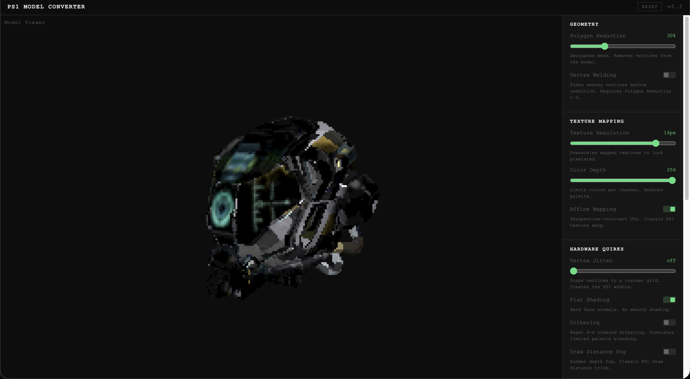
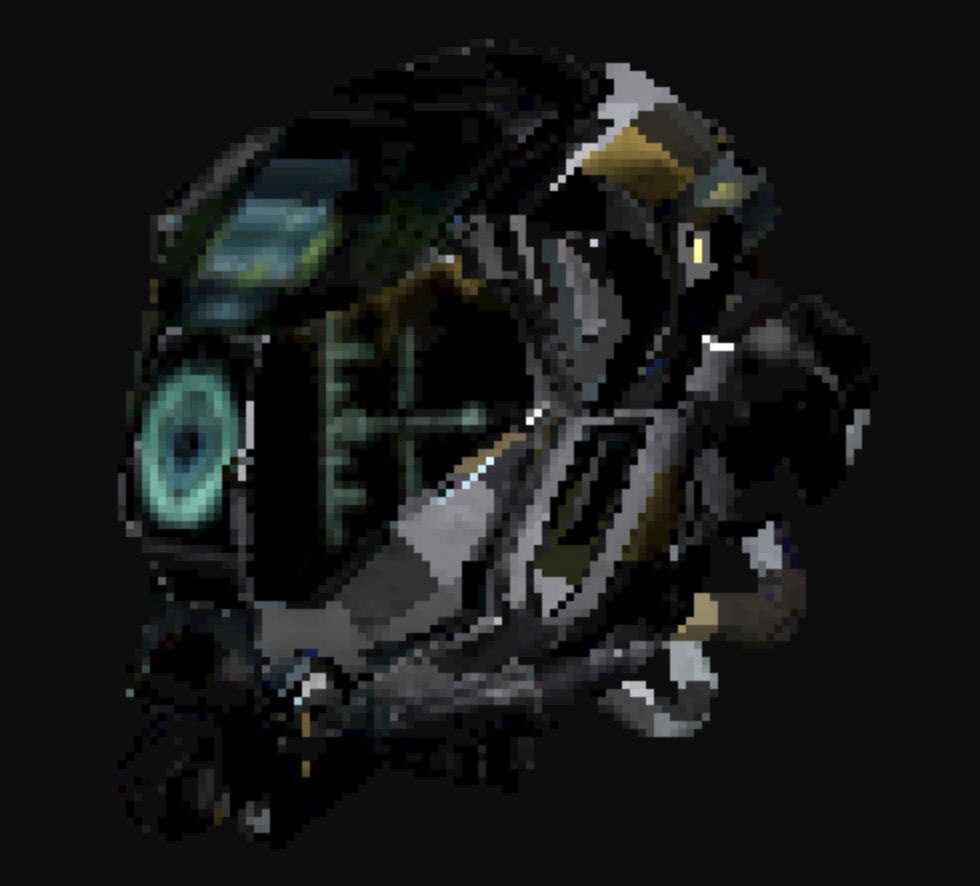

# ps1ify

Drop a 3D model, get the PlayStation 1 aesthetic — low-poly, pixelated, wobbly — in real time in your browser.



---

## Quick start

```bash
git clone https://github.com/rodriabregu/ps1ify.git
cd ps1ify
bun install
bun run dev
```

Open `http://localhost:5173`, drop a `.glb` or `.obj` file, and start adjusting.

> Requires [Bun](https://bun.sh) or Node.js 18+

---

## How to use

1. Drop a `.glb` or `.obj` onto the viewer (or click **BROWSE FILE**)
2. Dial in the PS1 look with the controls on the right
3. Export the result as **GLB**, **OBJ**, or grab the **texture PNG**

> **Best starting point:** Polygon Reduction + Texture Resolution give the most dramatic effect. Add Vertex Jitter for the characteristic wobble.

---

## Controls

| Section             | Control              | What it does                                                     |
| ------------------- | -------------------- | ---------------------------------------------------------------- |
| **Geometry**        | Polygon Reduction    | Decimates the mesh — fewer polygons, chunkier look               |
|                     | Vertex Welding       | Fuses duplicate vertices before reduction for cleaner results    |
| **Texture Mapping** | Texture Resolution   | Downscales textures from full res down to 8×8px                  |
|                     | Color Depth          | Reduces the palette per channel (posterization)                  |
|                     | Affine Mapping       | Perspective-incorrect UVs — the classic PS1 texture warp         |
| **Hardware Quirks** | Vertex Jitter        | Snaps vertices to a coarser screen grid — creates the PS1 wobble |
|                     | Flat Shading         | Hard face normals, no smooth interpolation                       |
|                     | Dithering            | Bayer 4×4 ordered dithering — simulates limited palette blending |
|                     | Draw Distance Fog    | Sudden depth fog — the classic PS1 draw distance trick           |
| **Lighting**        | Ambient / Key / Fill | Intensity and color for each light                               |
| **Render**          | Resolution           | From 0.25× (≈320×240) to full resolution                         |
|                     | Auto Rotate          | Spins the model automatically                                    |
|                     | Wireframe            | Overlays polygon edges — useful to see the reduction effect      |

---

## Preview



---

## Export

| Format          | Contents                                 | Best for                      |
| --------------- | ---------------------------------------- | ----------------------------- |
| **GLB**         | Geometry + textures in one binary file   | Unity, Godot, Blender         |
| **OBJ**         | Geometry only                            | Legacy tools, further editing |
| **Texture PNG** | Downscaled texture as a standalone image | Manual material setup         |

---

## Tech stack

- [Vite](https://vitejs.dev) + TypeScript
- [Three.js](https://threejs.org) r184
- Vanilla HTML/CSS — no UI framework

---

## License

MIT © [rodriabregu](https://github.com/rodriabregu)
